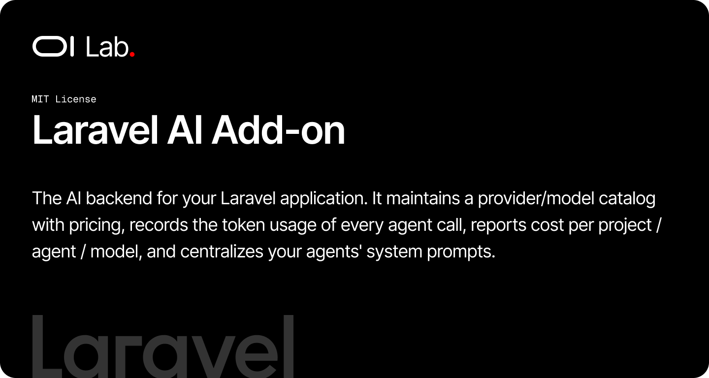

# OI Laravel AI Add-on

[](https://packagist.org/packages/oi-lab/oi-laravel-ai)
[](https://packagist.org/packages/oi-lab/oi-laravel-ai)
[](https://github.com/oi-lab/oi-laravel-ai/actions)
[](LICENSE)

The AI backend for your Laravel application. It maintains a provider/model catalog with pricing, records the token usage of every agent call, reports cost per project / agent / model, and centralizes your agents' system prompts.

## Features

- **Provider & model catalog** — `AiProvider` / `AiModel` tables with per-1M-token input/output pricing, seeded from a JSON registry shipped with the package.
- **Automatic usage tracking** — a listener records every `Laravel\Ai\Events\AgentPrompted` event into `ai_requests` (tokens, model, provider, project), with zero host code.
- **Cost reporting** — `AiUsageReporter` aggregates usage into per-project, per-agent, and per-model cost summaries over any period.
- **Prompt registry** — `AiPromptVariableRegistry` is the single source of truth for agent system prompts, with `:variable` placeholder compilation (mirrors mail templating).
- **Self-updating tariffs** — `php artisan ai:update-registry` fetches a fresh catalog and pricing from a remote URL and persists it locally.
- **Host-agnostic** — resolves the host's `Project` / `AgentRun` models through config and persists settings through a `SettingStore` contract.

## Requirements

- PHP 8.2+
- Laravel 12 or 13
- [`laravel/ai`](https://github.com/laravel/ai) 0.7+

## Installation

```bash
composer require oi-lab/oi-laravel-ai
```

The package auto-discovers and registers itself via Laravel's service provider mechanism.

### Assisted installation (recommended)

Run the interactive installer and answer the prompts — it publishes the config, captures the host models / setting store / registry into your `.env`, runs the migrations, and seeds the catalog. Every step is confirmed, so it is safe to re-run:

```bash
php artisan ai:install
```

### Manual installation

```bash
php artisan vendor:publish --tag=oi-laravel-ai-config
php artisan vendor:publish --tag=oi-laravel-ai-migrations
php artisan migrate
```

> The `ai_requests` table has nullable foreign keys to your `projects` and `agent_runs` tables (UUID keys). Make sure those tables exist before migrating, or adjust the published migration to match your schema.

## Configuration

`config/oi-laravel-ai.php`:

| Key | Description |
|-----|-------------|
| `models.project` | Host `Project` model the `AiRequest.project_id` FK resolves to. |
| `models.agent_run` | Host `AgentRun` model the `AiRequest.agent_run_id` FK resolves to. |
| `setting_store` | Class implementing `SettingStore`, used to persist default models and prompt overrides. Leave `null` to auto-detect: the `oi-lab/oi-laravel-settings` adapter is wired automatically when that package is installed. |
| `context_binding` | Container binding resolving the "current team" used to scope settings. |
| `registry.path` | Writable, host-owned registry copy used by the seeder and `ai:update-registry`. Falls back to the bundled `assets/registry.json` when null. |
| `registry.url` | Canonical raw URL `ai:update-registry` fetches a fresh registry from. |

All keys read from environment variables (`OI_AI_PROJECT_MODEL`, `OI_AI_SETTING_STORE`, `OI_AI_REGISTRY_PATH`, `OI_AI_REGISTRY_URL`, …).

## Usage

### Catalog

```php
use OiLab\OiLaravelAi\Support\AiCatalog;

$registry = AiCatalog::read();   // bundled asset or host-configured path
$counts = AiCatalog::sync($registry); // upserts providers + models
// ['providers' => 5, 'models' => 15]
```

Seed the catalog (and, when a `SettingStore` is bound, the default models + prompts) from your `DatabaseSeeder`:

```php
$this->call(\OiLab\OiLaravelAi\Database\Seeders\AiCatalogSeeder::class);
```

### Usage tracking

Tracking is automatic. Once the package is installed, every agent prompt dispatched through `laravel/ai` is recorded:

```php
use OiLab\OiLaravelAi\Models\AiRequest;

AiRequest::query()->where('prompt_type', 'DocWriterAgent')->count();
```

### Cost reporting

```php
use OiLab\OiLaravelAi\Services\AiUsageReporter;

$summary = app(AiUsageReporter::class)->summaryForProjects(
    projectIds: [$project->id],
    start: now()->startOfMonth(),
    end: now()->endOfMonth(),
);

$summary->estimated_cost_usd; // float, rounded to 4 decimals
$summary->by_agent_type;      // [['prompt_type' => ..., 'count' => ..., ...], ...]
$summary->by_model;           // [['model_name' => ..., 'count' => ..., ...], ...]
```

### Prompt registry

```php
use OiLab\OiLaravelAi\Support\AiPromptVariableRegistry;

$prompt = AiPromptVariableRegistry::compile(
    AiPromptVariableRegistry::defaultPrompt(AiPromptVariableRegistry::DOC_WRITER),
    ['project_name' => 'Acme', 'language' => 'français'],
);
```

The `app_name` global is injected automatically. Use `AiPromptVariableRegistry::keys()`, `label()`, and `variablesFor()` to build a settings UI.

## Commands

```bash
# Assisted, interactive installation (publish, configure, migrate, seed).
php artisan ai:install [--force]

# Refresh the catalog + pricing from the configured remote registry URL.
php artisan ai:update-registry [--url=https://…] [--no-write]
```

## Customizing host models

The package never hardcodes your domain models. Override the bindings in config so `AiRequest` belongs to your own `Project` / `AgentRun`:

```php
'models' => [
    'project' => \App\Models\Project::class,
    'agent_run' => \App\Models\AgentRun::class,
],
```

Settings (default models, prompt overrides) are persisted through the `SettingStore` contract. Install the recommended `oi-lab/oi-laravel-settings` (listed under `suggest`) and its adapter is wired automatically. To use your own storage, implement `OiLab\OiLaravelAi\Contracts\SettingStore` and point `setting_store` at it.

## Testing

```bash
composer test
```

## AI Assistant Skills

This package ships a skill that teaches AI coding assistants (Claude Code, JetBrains AI) how to use it. The recommended way to install it is the unified `oi:skills` command from `oi-lab/oi-laravel-development`:

```bash
php artisan oi:skills oilab-laravel-ai --project
```

A deprecated package-local fallback is available for projects that don't use `oi-lab/oi-laravel-development`:

```bash
php artisan oi-ai:install-ai-skill
```

See [docs/advanced/skills.md](docs/advanced/skills.md) for details.

## Documentation

The `docs/` folder is importable into any app using [`oi-lab/oi-laravel-documentation`](https://packagist.org/packages/oi-lab/oi-laravel-documentation):

```bash
php artisan doc:import
```

## License

The MIT License (MIT). See [LICENSE](LICENSE).

## Credits

**[Olivier Lacombe](https://www.olacombe.com)** - Creator and maintainer

Olivier is a Product & Technology Director based in Montpellier, France, with over 20 years of experience innovating in UX/UI and emerging technologies. He specializes in guiding enterprises toward cutting-edge digital solutions, combining user-centered design with continuous optimization and artificial intelligence integration.

**Projects & Resources:**
- [OI Dev Docs](https://dev.olacombe.com) - Documentation for all Open Source OI Lab packages
- [OnAI](https://onai.olacombe.com) - Training courses and masterclasses on generative AI for businesses
- [Promptr](https://promptr.olacombe.com) - Prompt engineering Management Platform

## Support

For support, please open an issue on the [GitHub repository](https://github.com/oi-lab/oi-laravel-ai/issues).
