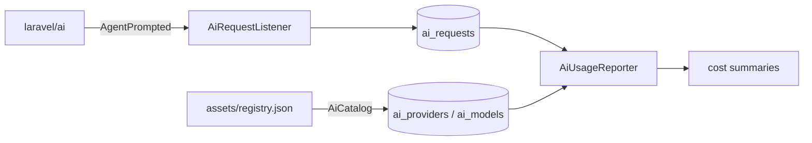

# OI Laravel AI

OI Laravel AI is the AI backend for a Laravel application built on top of [`laravel/ai`](https://github.com/laravel/ai). It answers four recurring needs when you ship AI features:

- **What models exist and what do they cost?** — a database-backed provider/model catalog with per-1M-token pricing.
- **How much are we spending?** — every agent call is recorded automatically, then aggregated into cost reports.
- **What are our agents actually prompting?** — a central registry of system prompts with variable interpolation.
- **How do we keep pricing current?** — a command that pulls a fresh tariff registry from a remote URL.

## How it fits together

The package is deliberately host-agnostic: it links recorded requests back to your own `Project` and `AgentRun` models through configuration, and never persists settings directly — it delegates to a `SettingStore` contract your application implements.

## Requirements

- PHP 8.3+
- Laravel 12 or 13
- `laravel/ai` 0.8 to 0.10

## Next steps

Follow the [Installation](installation.md) guide to add the package to your project.
